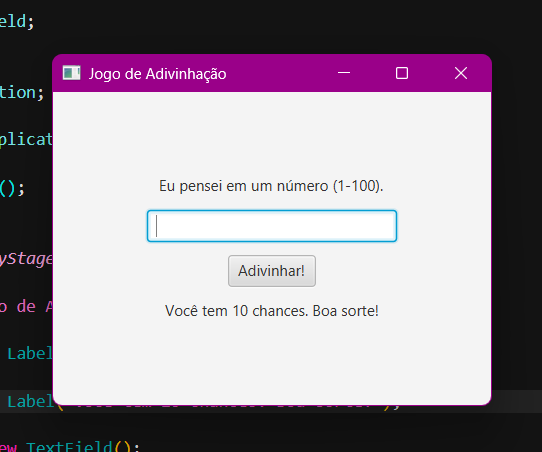

# 🎲 Jogo de Adivinhação em JavaFX

Um projeto clássico "Adivinhe o Número" construído em Java, que evoluiu de uma simples aplicação de console para uma interface gráfica (GUI) completa usando JavaFX.

## ✨ Funcionalidades (Features)

* **Interface Gráfica com JavaFX:** Uma janela de usuário limpa e interativa com botões, campos de texto e labels de feedback.
* **Arquitetura Robusta (OOP):** O projeto foi refatorado para ter uma separação clara entre a lógica do "Cérebro" do jogo (`Jogo.java`) e a "Face" visual (`JogoJavaFX.java`).
* **Limite de Tentativas:** O jogador tem 10 chances para adivinhar o número secreto.
* **Feedback em Tempo Real:** A interface atualiza o status ("Muito Alto!", "Muito Baixo!") e o contador de chances restantes a cada jogada.
* **Tratamento de Erros:** Validação de entrada (`try-catch`) que impede o aplicativo de quebrar se o usuário digitar texto em vez de números, mostrando uma mensagem de erro amigável.
* **Estado de "Fim de Jogo":** Os campos de entrada e o botão são desabilitados assim que o jogador ganha ou perde.

## 🛠️ Tecnologias Utilizadas

* **Java (JDK 25)**
* **JavaFX (SDK 25)** (para a Interface Gráfica)
* **VS Code** (com `launch.json` para configuração de VM)

---

## 🚀 Como Rodar Este Projeto

Este é um projeto JavaFX e requer o SDK do JavaFX para ser executado.

1.  **Baixe o JavaFX SDK:** Faça o download do [JavaFX SDK (para Windows x64)](https://gluonhq.com/products/javafx/) (use a versão LTS mais recente, como a 21 ou a 25).
2.  **Extraia o SDK:** Salve o SDK em um local permanente no seu computador (ex: `C:\Java\javafx-sdk-XX`).
3.  **Configure o `launch.json`:**
    * Este projeto já inclui um arquivo `.vscode/launch.json` com os argumentos corretos para a VM.
    * **IMPORTANTE:** Se o seu caminho para o SDK for diferente, você **precisará** editar a linha `"vmArgs"` no arquivo `.vscode/launch.json` para apontar para a pasta `lib` da **sua** instalação do JavaFX.

    *Exemplo da linha a ser editada no `launch.json`:*
    `"vmArgs": "--module-path \"C:\\SEU\\CAMINHO\\ATE\\javafx-sdk-XX\\lib\" --add-modules javafx.controls"`

---

## 📜 Licença

Este projeto está licenciado sob a **Licença MIT**. Veja o arquivo `LICENSE` para mais detalhes.